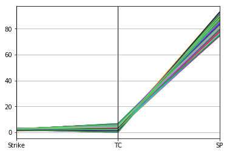
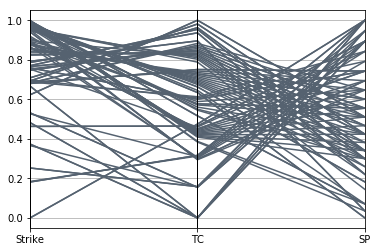
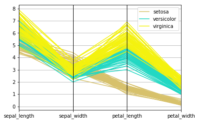

# Parallel plotting

A lo largo de esta libreta de python vamos a hacer un recorrido muy rápido sobre las diferentes funcionalidades implementadas.

He generado una clase "ParallelCoordinates" que, a partir de un dataframe de Pandas que contenga columnas de valores numéricos, tenga un método "plot()" que mostrará un gráfico de coordenadas paralelas y otro "save()" para salvarlo en diferentes formatos gráficos (png, html, jpg, etc). Los gráficos harán uso de la librería Bokeh, Plotly y Pyplot.


```python
from Code.parallelCoordinates import ParallelCoordinates

```

# PyPlot

Vamos a empezar por la librería que creo que es la mas básica pero que a su vez resulta la más fácil y rápida de usar. Esta librería es muy rápida y facil de usar, dando consecuentemente unos gráficos demasiado sencillos.Es muy util en caso de buscar un resultado simple y básico, no teniendo sentido intentar darle más complejidad ya que para ello existen otras librerias que veremos a continuación.


```python
parallel = ParallelCoordinates(file='data/FUN.BB11001.tsv', library='pyplot',  normalization=False, save_file_name = "Results/jpeh.png",tags=None, remove_legend= True, autosave=False, color_unique=False)
result = parallel.plot()
parallel.save(result)
```

    Reading data
    Calculate indexes
    Calculating best ranges
    Plotting data





    Guardamos los valores


Podemos cambiar los diferentes parámetros que tenemos en la función para hacer que tenga un solo color **color_unique = True**. También podemos normalizar los datos que le pasamos **normalization = True**.


```python
parallel = ParallelCoordinates(file='data/FUN.BB11001.tsv', library='pyplot',  normalization=True, tags=None, remove_legend= True, autosave=False, color_unique=True)
result = parallel.plot()
```

    Reading data
    Calculate indexes
    Normalizing data
    Calculating best ranges
    Plotting data





Para el dataSet *iris.csv*, vamos a mostrar una leyenda **remove_legend = *False***. Además tiene una opción para no tener que recurrir a la función save si no queremos y poder directamente guardar la gráfica. **autosave = *True***


```python
parallel = ParallelCoordinates(file='data/iris.csv', library='pyplot', save_file_name="Results/plot-output.png", normalization=False, tags=None, remove_legend= False, autosave=True, color_unique=False)
result = parallel.plot()
```

    Reading data
    Calculating best ranges
    Plotting data





Como hemos comprobado esta librería ofrece una alternativa muy visual, rapida, sencilla y accesible que puede resultar muy útil.

# Bokeh

A continuación vamos a ver la librería recomendada por el profesor: Bokeh, para plotear gráficos de coordenadas paralelas.

Cabe destacar que para esta librería no he encontrado una forma directa de generar los gráficos de coordenadas paralelas y los he automatizado yo para que se adapten a los datos y se unan las diferentes gráficas que podemos tener.Ha resultado especialmente dificil encontrar información para hacer gráficos de coordenadas paralelas.

En primer lugar vamos a probar la misma gráfica que tenemos arriba sobre los datos de iris.csv con los mismos parámetros para notar claramente las diferencias.


```python
bokeh1 = ParallelCoordinates(file='data/iris.csv', library='bokeh', save_file_name = "Results/bokeh1.png", normalization=False, tags=None, remove_legend= False, autosave=True, color_unique=False)
result = bokeh1.plot()

```

    Reading data
    Calculating best ranges
    Plotting data


    /home/joseroma/anaconda3/lib/python3.6/site-packages/selenium/webdriver/phantomjs/webdriver.py:49: UserWarning:
    
    Selenium support for PhantomJS has been deprecated, please use headless versions of Chrome or Firefox instead
    


Se abrirá una nueva ventana donde tendremos la gráfica, a simple vista, podemos notar poca diferencia.


```python
bokeh1 = ParallelCoordinates(file='data/FUN.BB11001.tsv', library='bokeh',save_file_name="Results/bokeh2.png" ,normalization=True, tags=None, remove_legend= False, autosave=True, color_unique=False)
result = bokeh1.plot()
```

    Reading data
    Calculate indexes
    Normalizing data
    Calculating best ranges
    Plotting data


    /home/joseroma/anaconda3/lib/python3.6/site-packages/selenium/webdriver/phantomjs/webdriver.py:49: UserWarning:
    
    Selenium support for PhantomJS has been deprecated, please use headless versions of Chrome or Firefox instead
    


Estas gráficas estan puestas de forma que se puedan mover de forma independiente, también podemos hacer zoom in y zoom out (además de todas las funcionalidades extra que podíamos encontrar anteriormente).

# Plotly

Bajo mi punto de vista, la mejor de todas las librerías para hacer gráficos de coordenadas paralelas. No solo ofrece todas las ventajas que la librería anterior, además, ofrece una forma de visualizar los datos mas llamativa y permite crear filtros dinámicamente de distinto tamaño sobre los propios ejes del gráfico .Esto nos permite encontrar fácilmente los diferentes clusters de información.


```python
from plotly import version
from plotly.offline import download_plotlyjs, init_notebook_mode, plot, iplot
print(version)
init_notebook_mode(connected=True)
plotly1 = ParallelCoordinates(file='data/FUN.BB11001.tsv', library='plotly', normalization=True, tags=None, remove_legend= False, autosave=False, color_unique=False)
result = plotly1.plot()
```

    <module 'plotly.version' from '/home/joseroma/anaconda3/lib/python3.6/site-packages/plotly/version.py'>


<script>requirejs.config({paths: { 'plotly': ['https://cdn.plot.ly/plotly-latest.min']},});if(!window.Plotly) {{require(['plotly'],function(plotly) {window.Plotly=plotly;});}}</script>


    Reading data
    Calculate indexes
    Normalizing data
    Calculating best ranges
    Plotting data
    5


<div id="bce6097d-a01e-4684-8816-a3de673e7a0f" style="height: 525px; width: 100%;" class="plotly-graph-div"></div><script type="text/javascript">require(["plotly"], function(Plotly) { window.PLOTLYENV=window.PLOTLYENV || {};window.PLOTLYENV.BASE_URL="https://plot.ly";Plotly.newPlot("bce6097d-a01e-4684-8816-a3de673e7a0f", [{"type": "parcoords", "line": {"color": [0, 1, 2, 3, 4, 5, 6, 7, 8, 9, 10, 11, 12, 13, 14, 15, 16, 17, 18, 19, 20, 21, 22, 23, 24, 25, 26, 27, 28, 29, 30, 31, 32, 33, 34, 35, 36, 37, 38, 39, 40, 41, 42, 43, 44, 45, 46, 47, 48, 49, 50, 51, 52, 53, 54, 55, 56, 57, 58, 59, 60, 61, 62, 63, 64, 65, 66, 67, 68, 69, 70, 71, 72, 73, 74, 75, 76, 77, 78, 79, 80, 81, 82, 83, 84, 85, 86, 87, 88, 89, 90, 91, 92, 93, 94, 95, 96, 97, 98], "colorscale": [[0, "#D7C16B"], [0.5, "#23D8C3"], [1, "#F3F10F"]]}, "dimensions": [{"range": [-1.0, 2], "constraintrange": [4, 8], "label": "Strike", "values": [0.0, 0.6230445886261582, 0.0, 0.3735559817887425, 0.9833259189583026, 0.25253392335539127, 0.18163583981316855, 0.9516784437502002, 0.6668707880611919, 0.9590090222985881, 0.5314352627982584, 0.18426862866427007, 0.36588150725133217, 0.6230445886261582, 0.7922725928321259, 1.0, 0.7086356918458023, 0.6668707880611919, 0.4630839005765398, 0.5314352627982584, 0.9821695794657526, 0.3735559817887425, 0.6800555198247438, 0.6876946662063579, 0.4630839005765398, 0.827990669969668, 0.9413256863869695, 0.6813851395671022, 0.8669603996422757, 0.482030906646171, 0.18163583981316855, 0.25253392335539127, 0.6835134916777155, 0.6871450800801862, 0.697883066836188, 0.6926901928089872, 0.9963072087284768, 0.7703596791154619, 0.9578526828060381, 0.8831063690233263, 0.9983292443433447, 0.7863051781522772, 0.9807666241937603, 0.7465358229695318, 0.9839370807285157, 0.7655236204206894, 0.7863051781522772, 0.98192296368631, 0.5266412665068505, 0.9776148504362263, 0.9893643192358856, 0.8858072460728597, 0.9705252901807837, 0.9601725328175532, 0.98192296368631, 0.9941650185279065, 0.9962284412700582, 0.9507631225505957, 0.9833259189583026, 0.7465358229695318, 0.482030906646171, 0.9970986485139672, 0.9187379375747895, 0.8239999500886133, 0.8511061311158992, 0.9961856765107446, 0.8970794326497205, 0.9970986485139672, 0.8732555765037906, 0.885274498044776, 0.8803451367592328, 0.6926901928089872, 0.7536253832249742, 0.9476208632484842, 0.907999950818787, 0.7703596791154619, 0.7528928109228572, 0.9890961162553027, 0.6800555198247438, 0.8922433739549478, 0.7086356918458023, 0.8398889071653832, 0.9736770639383179, 0.9547104235039261, 0.8398889071653832, 0.7922725928321259, 0.9583588500044855, 0.7590874925386011, 0.907999950818787, 0.8581956913713413, 0.8858072460728597, 0.7655236204206894, 0.8581956913713413, 0.9773466474556434, 0.8928968063283014, 0.9666086606996414, 0.7590874925386011, 0.9413256863869695, 0.8239999500886133]}, {"range": [-1.0, 2], "label": "TC", "values": [0.47465437788018433, 1.0, 0.47465437788018433, 0.0, 0.6342364532019703, 0.15821812596006143, 0.31643625192012287, 0.29428571428571426, 0.0, 0.7882653061224488, 0.15488721804511277, 0.3130699088145896, 0.15653495440729479, 1.0, 0.8956521739130434, 0.3838509316770186, 0.9626168224299065, 0.0, 0.46466165413533833, 0.15488721804511277, 0.6453634085213031, 0.0, 0.7507288629737608, 0.6130952380952381, 0.46466165413533833, 0.8328840970350403, 0.2972582972582973, 0.8828571428571428, 0.30654761904761896, 0.0, 0.31643625192012287, 0.15821812596006143, 0.874115983026874, 0.743145743145743, 0.6067746686303386, 0.980952380952381, 0.40873015873015867, 0.9537037037037038, 0.8025974025974024, 0.3033873343151694, 0.3872180451127819, 0.9363636363636361, 0.674967234600262, 0.8655462184873951, 0.4244505494505494, 0.8489010989010987, 0.9363636363636361, 0.6628056628056628, 0.30977443609022554, 0.4285714285714286, 0.42040816326530606, 0.45043731778425644, 0.4327731092436975, 0.437057991513437, 0.6628056628056628, 0.41644204851752015, 0.4125500667556742, 0.8099606815203144, 0.6342364532019703, 0.8655462184873951, 0.0, 0.5162907268170425, 0.4414285714285714, 0.8408163265306121, 0.7357142857142857, 0.544973544973545, 0.8174603174603172, 0.5162907268170425, 0.7212885154061626, 0.5885714285714285, 0.7142857142857142, 0.980952380952381, 0.8571428571428572, 0.7006802721088434, 0.5770308123249298, 0.9537037037037038, 0.45982142857142855, 0.5500667556742322, 0.7507288629737608, 0.7074175824175825, 0.9626168224299065, 0.8251001335113484, 0.6812169312169312, 0.6940700808625336, 0.8251001335113484, 0.8956521739130434, 0.5714285714285715, 0.6005830903790087, 0.5770308123249298, 0.7284299858557285, 0.45043731778425644, 0.8489010989010987, 0.7284299858557285, 0.5605442176870747, 0.44588744588744583, 0.6875834445927903, 0.6005830903790087, 0.2972582972582973, 0.8408163265306121]}, {"range": [-1.0, 2], "label": "SP", "values": [1.0, 0.5103419164204324, 1.0, 1.0, 0.0, 1.0, 1.0, 0.6469565217391313, 0.8938215102974834, 0.14440993788819956, 0.8938215102974834, 0.9463459759481987, 0.9463459759481987, 0.5103419164204324, 0.03516068052930166, 0.03516068052930166, 0.3401056481105247, 0.8938215102974834, 0.8938215102974834, 0.8938215102974834, 0.07093821510297538, 1.0, 0.7426796805678801, 0.842391304347827, 0.8938215102974834, 0.38146021328958213, 0.6943346508563915, 0.6469565217391313, 0.842391304347827, 0.9463459759481987, 1.0, 1.0, 0.6005165733964706, 0.6943346508563915, 0.7920215150156897, 0.42360248447205073, 0.29951690821256083, 0.29951690821256083, 0.2205533596837954, 0.7920215150156897, 0.07093821510297538, 0.2205533596837954, 0.25967291583566077, 0.5549872122762158, 0.46655518394648876, 0.46655518394648876, 0.2205533596837954, 0.18213866039953075, 0.8938215102974834, 0.5103419164204324, 0.42360248447205073, 0.7426796805678801, 0.5549872122762158, 0.6005165733964706, 0.18213866039953075, 0.38146021328958213, 0.3401056481105247, 0.25967291583566077, 0.0, 0.5549872122762158, 0.9463459759481987, 0.07093821510297538, 0.6469565217391313, 0.42360248447205073, 0.6469565217391313, 0.29951690821256083, 0.29951690821256083, 0.07093821510297538, 0.5549872122762158, 0.6469565217391313, 0.5103419164204324, 0.42360248447205073, 0.5103419164204324, 0.42360248447205073, 0.5549872122762158, 0.29951690821256083, 0.842391304347827, 0.3401056481105247, 0.7426796805678801, 0.46655518394648876, 0.3401056481105247, 0.3401056481105247, 0.29951690821256083, 0.38146021328958213, 0.3401056481105247, 0.03516068052930166, 0.5103419164204324, 0.7426796805678801, 0.5549872122762158, 0.6005165733964706, 0.7426796805678801, 0.46655518394648876, 0.6005165733964706, 0.42360248447205073, 0.6943346508563915, 0.3401056481105247, 0.7426796805678801, 0.6943346508563915, 0.42360248447205073]}]}], {"plot_bgcolor": "#E5E5E5", "paper_bgcolor": "#E5E5E5"}, {"showLink": true, "linkText": "Export to plot.ly"})});</script>


    <IPython.core.display.HTML object>


Como se ha mencionado anteriomente, vemos que podemos filtrar los datos. Manteniendo pulsado unel ratón sobre un eje podemos seleccionar el rango en el que podemos filtrar los diferentes datos. Dentro de los datos seleccionados, podemos diferenciar facilmente los clusters gracias a los colores de cada uno.


```python
bokeh1 = ParallelCoordinates(file='data/iris.csv', library='plotly', normalization=False, tags=None, remove_legend= False, autosave=False, color_unique=False)
result = bokeh1.plot()
```

    Reading data
    Calculating best ranges
    Plotting data
    6


<div id="46c9a04c-1a34-4fe8-b069-8e94131a1823" style="height: 525px; width: 100%;" class="plotly-graph-div"></div><script type="text/javascript">require(["plotly"], function(Plotly) { window.PLOTLYENV=window.PLOTLYENV || {};window.PLOTLYENV.BASE_URL="https://plot.ly";Plotly.newPlot("46c9a04c-1a34-4fe8-b069-8e94131a1823", [{"type": "parcoords", "line": {"color": [0, 0, 0, 0, 0, 0, 0, 0, 0, 0, 0, 0, 0, 0, 0, 0, 0, 0, 0, 0, 0, 0, 0, 0, 0, 0, 0, 0, 0, 0, 0, 0, 0, 0, 0, 0, 0, 0, 0, 0, 0, 0, 0, 0, 0, 0, 0, 0, 0, 0, 1, 1, 1, 1, 1, 1, 1, 1, 1, 1, 1, 1, 1, 1, 1, 1, 1, 1, 1, 1, 1, 1, 1, 1, 1, 1, 1, 1, 1, 1, 1, 1, 1, 1, 1, 1, 1, 1, 1, 1, 1, 1, 1, 1, 1, 1, 1, 1, 1, 1, 2, 2, 2, 2, 2, 2, 2, 2, 2, 2, 2, 2, 2, 2, 2, 2, 2, 2, 2, 2, 2, 2, 2, 2, 2, 2, 2, 2, 2, 2, 2, 2, 2, 2, 2, 2, 2, 2, 2, 2, 2, 2, 2, 2, 2, 2, 2, 2, 2, 2], "colorscale": [[0, "#D7C16B"], [0.5, "#23D8C3"], [1, "#F3F10F"]]}, "dimensions": [{"range": [0.0, 15], "label": "sepal_length", "values": [5.1, 4.9, 4.7, 4.6, 5.0, 5.4, 4.6, 5.0, 4.4, 4.9, 5.4, 4.8, 4.8, 4.3, 5.8, 5.7, 5.4, 5.1, 5.7, 5.1, 5.4, 5.1, 4.6, 5.1, 4.8, 5.0, 5.0, 5.2, 5.2, 4.7, 4.8, 5.4, 5.2, 5.5, 4.9, 5.0, 5.5, 4.9, 4.4, 5.1, 5.0, 4.5, 4.4, 5.0, 5.1, 4.8, 5.1, 4.6, 5.3, 5.0, 7.0, 6.4, 6.9, 5.5, 6.5, 5.7, 6.3, 4.9, 6.6, 5.2, 5.0, 5.9, 6.0, 6.1, 5.6, 6.7, 5.6, 5.8, 6.2, 5.6, 5.9, 6.1, 6.3, 6.1, 6.4, 6.6, 6.8, 6.7, 6.0, 5.7, 5.5, 5.5, 5.8, 6.0, 5.4, 6.0, 6.7, 6.3, 5.6, 5.5, 5.5, 6.1, 5.8, 5.0, 5.6, 5.7, 5.7, 6.2, 5.1, 5.7, 6.3, 5.8, 7.1, 6.3, 6.5, 7.6, 4.9, 7.3, 6.7, 7.2, 6.5, 6.4, 6.8, 5.7, 5.8, 6.4, 6.5, 7.7, 7.7, 6.0, 6.9, 5.6, 7.7, 6.3, 6.7, 7.2, 6.2, 6.1, 6.4, 7.2, 7.4, 7.9, 6.4, 6.3, 6.1, 7.7, 6.3, 6.4, 6.0, 6.9, 6.7, 6.9, 5.8, 6.8, 6.7, 6.7, 6.3, 6.5, 6.2, 5.9]}, {"range": [0.0, 15], "label": "sepal_width", "values": [3.5, 3.0, 3.2, 3.1, 3.6, 3.9, 3.4, 3.4, 2.9, 3.1, 3.7, 3.4, 3.0, 3.0, 4.0, 4.4, 3.9, 3.5, 3.8, 3.8, 3.4, 3.7, 3.6, 3.3, 3.4, 3.0, 3.4, 3.5, 3.4, 3.2, 3.1, 3.4, 4.1, 4.2, 3.1, 3.2, 3.5, 3.1, 3.0, 3.4, 3.5, 2.3, 3.2, 3.5, 3.8, 3.0, 3.8, 3.2, 3.7, 3.3, 3.2, 3.2, 3.1, 2.3, 2.8, 2.8, 3.3, 2.4, 2.9, 2.7, 2.0, 3.0, 2.2, 2.9, 2.9, 3.1, 3.0, 2.7, 2.2, 2.5, 3.2, 2.8, 2.5, 2.8, 2.9, 3.0, 2.8, 3.0, 2.9, 2.6, 2.4, 2.4, 2.7, 2.7, 3.0, 3.4, 3.1, 2.3, 3.0, 2.5, 2.6, 3.0, 2.6, 2.3, 2.7, 3.0, 2.9, 2.9, 2.5, 2.8, 3.3, 2.7, 3.0, 2.9, 3.0, 3.0, 2.5, 2.9, 2.5, 3.6, 3.2, 2.7, 3.0, 2.5, 2.8, 3.2, 3.0, 3.8, 2.6, 2.2, 3.2, 2.8, 2.8, 2.7, 3.3, 3.2, 2.8, 3.0, 2.8, 3.0, 2.8, 3.8, 2.8, 2.8, 2.6, 3.0, 3.4, 3.1, 3.0, 3.1, 3.1, 3.1, 2.7, 3.2, 3.3, 3.0, 2.5, 3.0, 3.4, 3.0]}, {"range": [0.0, 15], "label": "petal_length", "values": [1.4, 1.4, 1.3, 1.5, 1.4, 1.7, 1.4, 1.5, 1.4, 1.5, 1.5, 1.6, 1.4, 1.1, 1.2, 1.5, 1.3, 1.4, 1.7, 1.5, 1.7, 1.5, 1.0, 1.7, 1.9, 1.6, 1.6, 1.5, 1.4, 1.6, 1.6, 1.5, 1.5, 1.4, 1.5, 1.2, 1.3, 1.5, 1.3, 1.5, 1.3, 1.3, 1.3, 1.6, 1.9, 1.4, 1.6, 1.4, 1.5, 1.4, 4.7, 4.5, 4.9, 4.0, 4.6, 4.5, 4.7, 3.3, 4.6, 3.9, 3.5, 4.2, 4.0, 4.7, 3.6, 4.4, 4.5, 4.1, 4.5, 3.9, 4.8, 4.0, 4.9, 4.7, 4.3, 4.4, 4.8, 5.0, 4.5, 3.5, 3.8, 3.7, 3.9, 5.1, 4.5, 4.5, 4.7, 4.4, 4.1, 4.0, 4.4, 4.6, 4.0, 3.3, 4.2, 4.2, 4.2, 4.3, 3.0, 4.1, 6.0, 5.1, 5.9, 5.6, 5.8, 6.6, 4.5, 6.3, 5.8, 6.1, 5.1, 5.3, 5.5, 5.0, 5.1, 5.3, 5.5, 6.7, 6.9, 5.0, 5.7, 4.9, 6.7, 4.9, 5.7, 6.0, 4.8, 4.9, 5.6, 5.8, 6.1, 6.4, 5.6, 5.1, 5.6, 6.1, 5.6, 5.5, 4.8, 5.4, 5.6, 5.1, 5.1, 5.9, 5.7, 5.2, 5.0, 5.2, 5.4, 5.1]}, {"range": [0.0, 15], "label": "petal_width", "values": [0.2, 0.2, 0.2, 0.2, 0.2, 0.4, 0.3, 0.2, 0.2, 0.1, 0.2, 0.2, 0.1, 0.1, 0.2, 0.4, 0.4, 0.3, 0.3, 0.3, 0.2, 0.4, 0.2, 0.5, 0.2, 0.2, 0.4, 0.2, 0.2, 0.2, 0.2, 0.4, 0.1, 0.2, 0.1, 0.2, 0.2, 0.1, 0.2, 0.2, 0.3, 0.3, 0.2, 0.6, 0.4, 0.3, 0.2, 0.2, 0.2, 0.2, 1.4, 1.5, 1.5, 1.3, 1.5, 1.3, 1.6, 1.0, 1.3, 1.4, 1.0, 1.5, 1.0, 1.4, 1.3, 1.4, 1.5, 1.0, 1.5, 1.1, 1.8, 1.3, 1.5, 1.2, 1.3, 1.4, 1.4, 1.7, 1.5, 1.0, 1.1, 1.0, 1.2, 1.6, 1.5, 1.6, 1.5, 1.3, 1.3, 1.3, 1.2, 1.4, 1.2, 1.0, 1.3, 1.2, 1.3, 1.3, 1.1, 1.3, 2.5, 1.9, 2.1, 1.8, 2.2, 2.1, 1.7, 1.8, 1.8, 2.5, 2.0, 1.9, 2.1, 2.0, 2.4, 2.3, 1.8, 2.2, 2.3, 1.5, 2.3, 2.0, 2.0, 1.8, 2.1, 1.8, 1.8, 1.8, 2.1, 1.6, 1.9, 2.0, 2.2, 1.5, 1.4, 2.3, 2.4, 1.8, 1.8, 2.1, 2.4, 2.3, 1.9, 2.3, 2.5, 2.3, 1.9, 2.0, 2.3, 1.8]}]}], {"plot_bgcolor": "#E5E5E5", "paper_bgcolor": "#E5E5E5"}, {"showLink": true, "linkText": "Export to plot.ly"})});</script>


    <IPython.core.display.HTML object>


Para ver más información sobre el código también puedes mirar dentro de la carpeta code, la libreta que hay explicando el código o directamente ver los comentarios que hay puestos sobre el mismo código.
