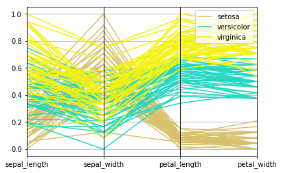
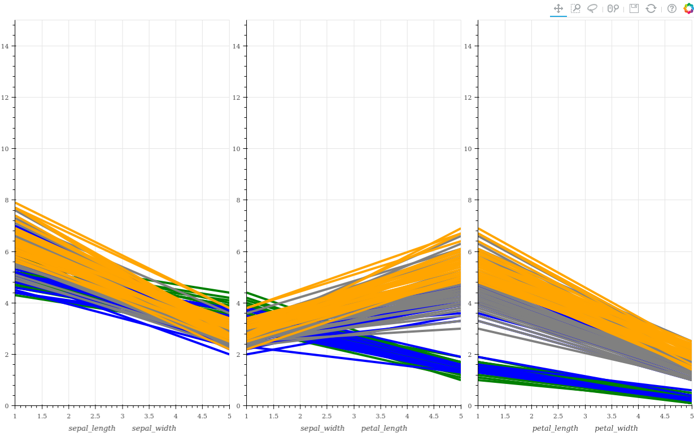

# Explicación del código

A continuación vamos a ir paso a paso explicando como hemos implementado el código

## Atributos

Los parámetros que les podemos 


```python

import pandas as pd
import plotly.plotly as py
from sklearn import preprocessing
from IPython.display import HTML
from metakernel.display import display
import matplotlib.pyplot as plt
from pandas.plotting import parallel_coordinates
from bokeh.layouts import gridplot
from bokeh.plotting import figure, show, save
import plotly.offline as offline
from bokeh.io import export_png, output_file
import plotly.graph_objs as go
from bokeh.models import PanTool, WheelZoomTool, LassoSelectTool
colors = ["red", "green", "blue", "grey", "orange", "black", "firebrick", "navy", "olive"]


#Aquí vamos a inicializar para este ejemplo los valores que le pasaríamos a la función

file = '../data/iris.csv'
library = 'plotly'
normalization = True
tags = None
remove_legend = False
autosave = False
color_unique = False
save_file_name = '../Results/data.png'
```

Pasamos a la función ***plot***. Para ello lo primero que vamos a hacer es leer los datos. Esto lo hacemos con ayuda de la librería de pandas que permite leer datos de forma muy sencilla. Para archivos terminados en ``.tsv`` hemos puesto por defecto unos nombres a las diferentes columnas leidas.


Lo hacemos de diferentes formas:


```python
print("Reading data")
#Vemos cual es la extensión
exten = file.split('.')
extension = exten[len(exten)-1]
#Leemos los archivos .tsv
if extension == 'tsv':
    df = pd.read_table(self.file)
    #Para los archivos .tsv eliminamos la última columna que se suele leer y no tiene nada
    df = df.drop(list(df)[-1], 1)
    
    #Calculamos los índices para poder hacer los plots
    print("Calculate indexes")
    par = list(df)
    #Añadimos los índices
    df[len(par)] = df.index
    #Establecemos nombres a las columnas
    df.columns = ["Strike", "TC", "SP", "Index"]
    #Damos opción para indicar tags diferentes
    if tags != None:
        dfd = self.tags
        dfd.append("Indice")
        if(len(dfd) == len(list(df))):
            df.columns = dfd
        else:
            raise Exception("Number of tags: " + str(len(dfd)-1) + "  missmatched column length  -->   " + str(len(list(df))-1))
#Leemos archivos que acepta read_csv
elif (extension == 'csv' or extension == 'txt'):
    df = pd.read_csv(file)
```

    Reading data


A continuación vamos a pasar a implementar la opción de normalizar los datos del dataFrame leido anteriormente.


```python
name_data_frame = list(df)
if normalization == True:
    print("Normalizing data")
    #Eliminamos temporalmente ultima columna 
    num = df[list(df)[-1]]
    df = df.drop(list(df)[-1], 1)
    #Normalizamos los datos
    x = df.values  # returns a numpy array
    min_max_scaler = preprocessing.MinMaxScaler()
    x_scaled = min_max_scaler.fit_transform(x)
    #Volvemos a añadir el dataFrame
    df = pd.DataFrame(x_scaled)
    df[len(list(df))] = num
    df.columns = name_data_frame
```

    Normalizing data


Habiendo leído los datos, y normalizado pasamos a calcular los rangos que vamos a usar a la hora de plotear los datos.


```python
print("Calculating best ranges")
#Inicializamos las variables
max_range_values = []
min_range_values = []
final_max_value = 0
final_min_value = 0
pared = list(df)
for l in range(0, len(pared)-1):
    max1 = max(df[pared[l]])
    min1 = min(df[pared[l]])
    if l < len(pared)-3:
         max2 = max(df[pared[l + 1]])
         min2 = min(df[pared[l + 1]])
         max_range_values.append(max(int(max1*2), int(max2*1.2)))
         min_range_values.append(min(min1-1, min2-1))
    if l == len(pared)-2:
        max_range_values.append(max(df[pared[l]]*1.2))
        min_range_values.append(min(df[pared[l]]))
        final_max_value = max(max_range_values)
        final_min_value = min(min_range_values)
```

    Calculating best ranges


Finalmente pasamos a plotear los datos, tenemos tres condiciones una para cada librería que hemos utilizado. Pasamos a ver la primera de ellas ***pyploy***.


Como se menciona en la otra libreta es la mas básica pero que a su vez resulta la más fácil y rápida de usar. Esta librería es muy rápida y facil de usar, dando consecuentemente unos gráficos demasiado sencillos.Es muy util en caso de buscar un resultado simple y básico, no teniendo sentido intentar darle más complejidad ya que para ello existen otras librerias que veremos a continuación.


```python
division = list(df)[-1]
#Limpiamos la figura en caso de que tuviesemos algo
plt.close()
plt.figure()
plt.clf()
#Ofrece la opción de plotear de un solo color
if color_unique ==True:
    fig = parallel_coordinates(df, division, color=('#556270'))
elif color_unique == False:
    fig = parallel_coordinates(df, division)
#Ofrece la opcion de eliminar la leyenda
if (remove_legend == True):
    plt.gca().legend_.remove()
#Ofrece la opcion de guardar la gráfica
if autosave == True:
    plt.savefig('autosave-pyplot.jpg')
#Mostramos la gráfica
plt.show()
fig = df
```





## Save()


El siguiente caso es ``pyploy``, podremos guardar las imágenes en los siguientes formatos:
 - **.RGBA**
 - **.DS**
 - **.JPEG**
 - **.PDF**
 - **.PGF**
 - **.SVG2**
 - **.TIFF**
 - **.SVG**
 - **.RAW**
 - **.PNG**
 - **.JPG**
 - **.EPS**
 - **.TIF**


```python
division = list(fig)[-1]
plt.figure()
if color_unique == True:
     parallel_coordinates(fig, division, color=('#556270'))
else:
    parallel_coordinates(fig, division)
if (remove_legend == True):
    plt.gca().legend_.remove()
plt.savefig(save_file_name)
```

# Plotly

Pasamos a continuación a ver el caso del ***plotly***. A mi parecer la mejor opción como detallo en profundidad en la otra libreta donde explico como utilizar las funciones.


```python
from plotly import version
from plotly.offline import download_plotlyjs, init_notebook_mode, plot, iplot
print(version)
init_notebook_mode(connected=True)

#Vamos a generar unos indices para poder identificar las columnas en forma de ids

levels = df[pared[-1]].unique()
new_column = []
for o in range(0, len(df[pared[-1]])):
    for q in range(0, len(levels)):
        if df[pared[-1]][o] == levels[q]:
            new_column.insert(o, q)
df[len(list(df))] = new_column
df = df.rename(columns={len(list(df)) - 1: "autoIndexes"})
print(len(list(df)))


           

```

    <module 'plotly.version' from '/home/joseroma/anaconda3/lib/python3.6/site-packages/plotly/version.py'>


<script>requirejs.config({paths: { 'plotly': ['https://cdn.plot.ly/plotly-latest.min']},});if(!window.Plotly) {{require(['plotly'],function(plotly) {window.Plotly=plotly;});}}</script>


    6


```python
if len(list(df)) == 6:
    data = [
        go.Parcoords(
            #Añadimos el id y los colores que vamos a usar
            line=dict(color=df['autoIndexes'],colorscale=[[0, '#D7C16B'], [0.5, '#23D8C3'], [1, '#F3F10F']]),
            dimensions=list([dict(range=[final_min_value, final_max_value],
                #Vamos a añadiendo las diferentes subplots que se añaden al final
                label=pared[0], values=df[pared[0]]),dict(range=[final_min_value, final_max_value],
                label=pared[1], values=df[pared[1]]),dict(range=[final_min_value, final_max_value],
                label=pared[2], values=df[pared[2]]),dict(range=[final_min_value, final_max_value],
                label=pared[3], values=df[pared[3]])
            ])
        )
    ]
```


```python
#Coloreamos el fondo de la figura
layout = go.Layout(plot_bgcolor='#E5E5E5',paper_bgcolor='#E5E5E5')
#Utilizamos la librería offline de plotly para hacer el gráfico
fig = go.Figure(data=data, layout=layout)
if autosave == True:
    offline.plot(fig, image = 'png',output_type='file', image_filename='../Results/plotlyautosave.png', filename="../Results/ployly-results.html")
if autosave == False:
    off = offline.iplot(fig)
```


<div id="16f68dea-d06c-431f-8590-a79dc2fb7e9e" style="height: 525px; width: 100%;" class="plotly-graph-div"></div><script type="text/javascript">require(["plotly"], function(Plotly) { window.PLOTLYENV=window.PLOTLYENV || {};window.PLOTLYENV.BASE_URL="https://plot.ly";Plotly.newPlot("16f68dea-d06c-431f-8590-a79dc2fb7e9e", [{"type": "parcoords", "line": {"color": [0, 0, 0, 0, 0, 0, 0, 0, 0, 0, 0, 0, 0, 0, 0, 0, 0, 0, 0, 0, 0, 0, 0, 0, 0, 0, 0, 0, 0, 0, 0, 0, 0, 0, 0, 0, 0, 0, 0, 0, 0, 0, 0, 0, 0, 0, 0, 0, 0, 0, 1, 1, 1, 1, 1, 1, 1, 1, 1, 1, 1, 1, 1, 1, 1, 1, 1, 1, 1, 1, 1, 1, 1, 1, 1, 1, 1, 1, 1, 1, 1, 1, 1, 1, 1, 1, 1, 1, 1, 1, 1, 1, 1, 1, 1, 1, 1, 1, 1, 1, 2, 2, 2, 2, 2, 2, 2, 2, 2, 2, 2, 2, 2, 2, 2, 2, 2, 2, 2, 2, 2, 2, 2, 2, 2, 2, 2, 2, 2, 2, 2, 2, 2, 2, 2, 2, 2, 2, 2, 2, 2, 2, 2, 2, 2, 2, 2, 2, 2, 2], "colorscale": [[0, "#D7C16B"], [0.5, "#23D8C3"], [1, "#F3F10F"]]}, "dimensions": [{"range": [-1.0, 2], "label": "sepal_length", "values": [0.2222222222222221, 0.16666666666666674, 0.11111111111111116, 0.08333333333333326, 0.19444444444444442, 0.3055555555555556, 0.08333333333333326, 0.19444444444444442, 0.0277777777777779, 0.16666666666666674, 0.3055555555555556, 0.13888888888888884, 0.13888888888888884, 0.0, 0.4166666666666665, 0.38888888888888884, 0.3055555555555556, 0.2222222222222221, 0.38888888888888884, 0.2222222222222221, 0.3055555555555556, 0.2222222222222221, 0.08333333333333326, 0.2222222222222221, 0.13888888888888884, 0.19444444444444442, 0.19444444444444442, 0.25, 0.25, 0.11111111111111116, 0.13888888888888884, 0.3055555555555556, 0.25, 0.33333333333333326, 0.16666666666666674, 0.19444444444444442, 0.33333333333333326, 0.16666666666666674, 0.0277777777777779, 0.2222222222222221, 0.19444444444444442, 0.05555555555555558, 0.0277777777777779, 0.19444444444444442, 0.2222222222222221, 0.13888888888888884, 0.2222222222222221, 0.08333333333333326, 0.2777777777777777, 0.19444444444444442, 0.75, 0.5833333333333335, 0.7222222222222223, 0.33333333333333326, 0.6111111111111112, 0.38888888888888884, 0.5555555555555556, 0.16666666666666674, 0.6388888888888888, 0.25, 0.19444444444444442, 0.44444444444444464, 0.4722222222222223, 0.4999999999999998, 0.36111111111111094, 0.6666666666666667, 0.36111111111111094, 0.4166666666666665, 0.5277777777777779, 0.36111111111111094, 0.44444444444444464, 0.4999999999999998, 0.5555555555555556, 0.4999999999999998, 0.5833333333333335, 0.6388888888888888, 0.6944444444444444, 0.6666666666666667, 0.4722222222222223, 0.38888888888888884, 0.33333333333333326, 0.33333333333333326, 0.4166666666666665, 0.4722222222222223, 0.3055555555555556, 0.4722222222222223, 0.6666666666666667, 0.5555555555555556, 0.36111111111111094, 0.33333333333333326, 0.33333333333333326, 0.4999999999999998, 0.4166666666666665, 0.19444444444444442, 0.36111111111111094, 0.38888888888888884, 0.38888888888888884, 0.5277777777777779, 0.2222222222222221, 0.38888888888888884, 0.5555555555555556, 0.4166666666666665, 0.7777777777777777, 0.5555555555555556, 0.6111111111111112, 0.9166666666666665, 0.16666666666666674, 0.833333333333333, 0.6666666666666667, 0.8055555555555556, 0.6111111111111112, 0.5833333333333335, 0.6944444444444444, 0.38888888888888884, 0.4166666666666665, 0.5833333333333335, 0.6111111111111112, 0.9444444444444442, 0.9444444444444442, 0.4722222222222223, 0.7222222222222223, 0.36111111111111094, 0.9444444444444442, 0.5555555555555556, 0.6666666666666667, 0.8055555555555556, 0.5277777777777779, 0.4999999999999998, 0.5833333333333335, 0.8055555555555556, 0.8611111111111112, 1.0, 0.5833333333333335, 0.5555555555555556, 0.4999999999999998, 0.9444444444444442, 0.5555555555555556, 0.5833333333333335, 0.4722222222222223, 0.7222222222222223, 0.6666666666666667, 0.7222222222222223, 0.4166666666666665, 0.6944444444444444, 0.6666666666666667, 0.6666666666666667, 0.5555555555555556, 0.6111111111111112, 0.5277777777777779, 0.44444444444444464]}, {"range": [-1.0, 2], "label": "sepal_width", "values": [0.625, 0.41666666666666674, 0.5, 0.45833333333333326, 0.6666666666666667, 0.7916666666666665, 0.5833333333333333, 0.5833333333333333, 0.375, 0.45833333333333326, 0.7083333333333333, 0.5833333333333333, 0.41666666666666674, 0.41666666666666674, 0.8333333333333333, 1.0, 0.7916666666666665, 0.625, 0.7499999999999998, 0.7499999999999998, 0.5833333333333333, 0.7083333333333333, 0.6666666666666667, 0.5416666666666665, 0.5833333333333333, 0.41666666666666674, 0.5833333333333333, 0.625, 0.5833333333333333, 0.5, 0.45833333333333326, 0.5833333333333333, 0.8749999999999998, 0.9166666666666667, 0.45833333333333326, 0.5, 0.625, 0.45833333333333326, 0.41666666666666674, 0.5833333333333333, 0.625, 0.12499999999999989, 0.5, 0.625, 0.7499999999999998, 0.41666666666666674, 0.7499999999999998, 0.5, 0.7083333333333333, 0.5416666666666665, 0.5, 0.5, 0.45833333333333326, 0.12499999999999989, 0.33333333333333326, 0.33333333333333326, 0.5416666666666665, 0.16666666666666663, 0.375, 0.29166666666666674, 0.0, 0.41666666666666674, 0.08333333333333337, 0.375, 0.375, 0.45833333333333326, 0.41666666666666674, 0.29166666666666674, 0.08333333333333337, 0.20833333333333326, 0.5, 0.33333333333333326, 0.20833333333333326, 0.33333333333333326, 0.375, 0.41666666666666674, 0.33333333333333326, 0.41666666666666674, 0.375, 0.25, 0.16666666666666663, 0.16666666666666663, 0.29166666666666674, 0.29166666666666674, 0.41666666666666674, 0.5833333333333333, 0.45833333333333326, 0.12499999999999989, 0.41666666666666674, 0.20833333333333326, 0.25, 0.41666666666666674, 0.25, 0.12499999999999989, 0.29166666666666674, 0.41666666666666674, 0.375, 0.375, 0.20833333333333326, 0.33333333333333326, 0.5416666666666665, 0.29166666666666674, 0.41666666666666674, 0.375, 0.41666666666666674, 0.41666666666666674, 0.20833333333333326, 0.375, 0.20833333333333326, 0.6666666666666667, 0.5, 0.29166666666666674, 0.41666666666666674, 0.20833333333333326, 0.33333333333333326, 0.5, 0.41666666666666674, 0.7499999999999998, 0.25, 0.08333333333333337, 0.5, 0.33333333333333326, 0.33333333333333326, 0.29166666666666674, 0.5416666666666665, 0.5, 0.33333333333333326, 0.41666666666666674, 0.33333333333333326, 0.41666666666666674, 0.33333333333333326, 0.7499999999999998, 0.33333333333333326, 0.33333333333333326, 0.25, 0.41666666666666674, 0.5833333333333333, 0.45833333333333326, 0.41666666666666674, 0.45833333333333326, 0.45833333333333326, 0.45833333333333326, 0.29166666666666674, 0.5, 0.5416666666666665, 0.41666666666666674, 0.20833333333333326, 0.41666666666666674, 0.5833333333333333, 0.41666666666666674]}, {"range": [-1.0, 2], "label": "petal_length", "values": [0.06779661016949151, 0.06779661016949151, 0.05084745762711865, 0.0847457627118644, 0.06779661016949151, 0.11864406779661013, 0.06779661016949151, 0.0847457627118644, 0.06779661016949151, 0.0847457627118644, 0.0847457627118644, 0.1016949152542373, 0.06779661016949151, 0.01694915254237289, 0.033898305084745756, 0.0847457627118644, 0.05084745762711865, 0.06779661016949151, 0.11864406779661013, 0.0847457627118644, 0.11864406779661013, 0.0847457627118644, 0.0, 0.11864406779661013, 0.15254237288135591, 0.1016949152542373, 0.1016949152542373, 0.0847457627118644, 0.06779661016949151, 0.1016949152542373, 0.1016949152542373, 0.0847457627118644, 0.0847457627118644, 0.06779661016949151, 0.0847457627118644, 0.033898305084745756, 0.05084745762711865, 0.0847457627118644, 0.05084745762711865, 0.0847457627118644, 0.05084745762711865, 0.05084745762711865, 0.05084745762711865, 0.1016949152542373, 0.15254237288135591, 0.06779661016949151, 0.1016949152542373, 0.06779661016949151, 0.0847457627118644, 0.06779661016949151, 0.6271186440677966, 0.5932203389830508, 0.6610169491525424, 0.5084745762711864, 0.6101694915254237, 0.5932203389830508, 0.6271186440677966, 0.38983050847457623, 0.6101694915254237, 0.49152542372881347, 0.423728813559322, 0.5423728813559322, 0.5084745762711864, 0.6271186440677966, 0.44067796610169496, 0.576271186440678, 0.5932203389830508, 0.5254237288135593, 0.5932203389830508, 0.49152542372881347, 0.6440677966101694, 0.5084745762711864, 0.6610169491525424, 0.6271186440677966, 0.559322033898305, 0.576271186440678, 0.6440677966101694, 0.6779661016949152, 0.5932203389830508, 0.423728813559322, 0.47457627118644063, 0.4576271186440678, 0.49152542372881347, 0.6949152542372881, 0.5932203389830508, 0.5932203389830508, 0.6271186440677966, 0.576271186440678, 0.5254237288135593, 0.5084745762711864, 0.576271186440678, 0.6101694915254237, 0.5084745762711864, 0.38983050847457623, 0.5423728813559322, 0.5423728813559322, 0.5423728813559322, 0.559322033898305, 0.3389830508474576, 0.5254237288135593, 0.847457627118644, 0.6949152542372881, 0.8305084745762712, 0.7796610169491525, 0.8135593220338982, 0.9491525423728813, 0.5932203389830508, 0.8983050847457625, 0.8135593220338982, 0.8644067796610169, 0.6949152542372881, 0.7288135593220338, 0.7627118644067796, 0.6779661016949152, 0.6949152542372881, 0.7288135593220338, 0.7627118644067796, 0.9661016949152543, 1.0, 0.6779661016949152, 0.7966101694915254, 0.6610169491525424, 0.9661016949152543, 0.6610169491525424, 0.7966101694915254, 0.847457627118644, 0.6440677966101694, 0.6610169491525424, 0.7796610169491525, 0.8135593220338982, 0.8644067796610169, 0.9152542372881356, 0.7796610169491525, 0.6949152542372881, 0.7796610169491525, 0.8644067796610169, 0.7796610169491525, 0.7627118644067796, 0.6440677966101694, 0.7457627118644068, 0.7796610169491525, 0.6949152542372881, 0.6949152542372881, 0.8305084745762712, 0.7966101694915254, 0.711864406779661, 0.6779661016949152, 0.711864406779661, 0.7457627118644068, 0.6949152542372881]}, {"range": [-1.0, 2], "label": "petal_width", "values": [0.04166666666666667, 0.04166666666666667, 0.04166666666666667, 0.04166666666666667, 0.04166666666666667, 0.125, 0.08333333333333333, 0.04166666666666667, 0.04166666666666667, 0.0, 0.04166666666666667, 0.04166666666666667, 0.0, 0.0, 0.04166666666666667, 0.125, 0.125, 0.08333333333333333, 0.08333333333333333, 0.08333333333333333, 0.04166666666666667, 0.125, 0.04166666666666667, 0.16666666666666669, 0.04166666666666667, 0.04166666666666667, 0.125, 0.04166666666666667, 0.04166666666666667, 0.04166666666666667, 0.04166666666666667, 0.125, 0.0, 0.04166666666666667, 0.0, 0.04166666666666667, 0.04166666666666667, 0.0, 0.04166666666666667, 0.04166666666666667, 0.08333333333333333, 0.08333333333333333, 0.04166666666666667, 0.20833333333333331, 0.125, 0.08333333333333333, 0.04166666666666667, 0.04166666666666667, 0.04166666666666667, 0.04166666666666667, 0.5416666666666667, 0.5833333333333334, 0.5833333333333334, 0.5000000000000001, 0.5833333333333334, 0.5000000000000001, 0.6250000000000001, 0.375, 0.5000000000000001, 0.5416666666666667, 0.375, 0.5833333333333334, 0.375, 0.5416666666666667, 0.5000000000000001, 0.5416666666666667, 0.5833333333333334, 0.375, 0.5833333333333334, 0.4166666666666667, 0.7083333333333334, 0.5000000000000001, 0.5833333333333334, 0.4583333333333333, 0.5000000000000001, 0.5416666666666667, 0.5416666666666667, 0.6666666666666667, 0.5833333333333334, 0.375, 0.4166666666666667, 0.375, 0.4583333333333333, 0.6250000000000001, 0.5833333333333334, 0.6250000000000001, 0.5833333333333334, 0.5000000000000001, 0.5000000000000001, 0.5000000000000001, 0.4583333333333333, 0.5416666666666667, 0.4583333333333333, 0.375, 0.5000000000000001, 0.4583333333333333, 0.5000000000000001, 0.5000000000000001, 0.4166666666666667, 0.5000000000000001, 1.0, 0.75, 0.8333333333333335, 0.7083333333333334, 0.8750000000000001, 0.8333333333333335, 0.6666666666666667, 0.7083333333333334, 0.7083333333333334, 1.0, 0.7916666666666667, 0.75, 0.8333333333333335, 0.7916666666666667, 0.9583333333333334, 0.9166666666666666, 0.7083333333333334, 0.8750000000000001, 0.9166666666666666, 0.5833333333333334, 0.9166666666666666, 0.7916666666666667, 0.7916666666666667, 0.7083333333333334, 0.8333333333333335, 0.7083333333333334, 0.7083333333333334, 0.7083333333333334, 0.8333333333333335, 0.6250000000000001, 0.75, 0.7916666666666667, 0.8750000000000001, 0.5833333333333334, 0.5416666666666667, 0.9166666666666666, 0.9583333333333334, 0.7083333333333334, 0.7083333333333334, 0.8333333333333335, 0.9583333333333334, 0.9166666666666666, 0.75, 0.9166666666666666, 1.0, 0.9166666666666666, 0.75, 0.7916666666666667, 0.9166666666666666, 0.7083333333333334]}]}], {"plot_bgcolor": "#E5E5E5", "paper_bgcolor": "#E5E5E5"}, {"showLink": true, "linkText": "Export to plot.ly"})});</script>


## Save()


El siguiente caso es ``plotly``, podremos guardar las imágenes en los siguientes formatos:
 - **.PNG**
 - **.PDF**
 - **.HTML**
 - **.JPEG**
    


```python
exten = save_file_name.split('.')
if exten[-1] == 'html':
    #Vovlemos a hacer el gráfico para guardarlo en HTML
    offline.plot(fig, image='png', output_type='file', image_filename=self.save_file_name,filename=self.save_file_name)
#Guardamos una imagen generada de la figura anterior
elif exten[-1] == 'jpeg' or exten[-1] == 'png' or exten[-1] == 'pdf':
    py.image.save_as(fig, filename=save_file_name)
    from IPython.display import Image
    Image(save_file_name)
else:
    raise Exception("El formato" + exten[-1] + " no lo soporta esta aplicacion.\n Tiene que elegir entre .png, .jpeg, .pdf y .html")

```


# Bokeh

A continuación vamos a ver la librería recomendada por el profesor: Bokeh, para plotear gráficos de coordenadas paralelas.

Cabe destacar que para esta librería no he encontrado una forma directa de generar los gráficos de coordenadas paralelas y los he automatizado yo para que se adapten a los datos y se unan las diferentes gráficas que podemos tener.Ha resultado especialmente dificil encontrar información para hacer gráficos de coordenadas paralelas.


```python
import warnings
warnings.filterwarnings('ignore')
plots = []
nombres = list(df)
count = 0
df.sort_values(nombres[1])
colourname = []
for i in range(0, len(nombres)-3):
    #Generamos la figura
    p = figure(x_range=(1, 5),x_axis_label=nombres[i]+'       '+nombres[i+1], y_range=(final_min_value, final_max_value), plot_width=400, plot_height=400)
    xs = []
    ys = []
    #Coloreamos  25%-25%-25%-25%
    for j in range(0, len(df[nombres[i]])):
        if i == 0:
            if j < len(df[nombres[i]])/4:
                colourname.append(colors[1])
        elif j>= len(df[nombres[i]])/4 and j< (2*len(df[nombres[i]])/4):
                colourname.append(colors[2])
        elif j>= 2*len(df[nombres[i]])/4 and j< 3*len(df[nombres[i]])/4:
                colourname.append(colors[3])
        elif j>= 3*len(df[nombres[i]])/4 and j< 4*len(df[nombres[i]])/4:
                colourname.append(colors[4])
        #Añadimos los valores
        xs.append([1, 5])
        ys.append([df[nombres[i]][j], df[nombres[i+1]][j]])
        count += 1
    #Generamos el plot
    if color_unique == True:
        p.multi_line(xs, ys, line_width=4)
    else:
        p.multi_line(xs, ys, color=colourname, line_width=4)
    p.add_tools(PanTool(), WheelZoomTool(),LassoSelectTool())
    plots.append(p)
#Añadimos las diferentes gráficas generadas
fig = gridplot([plots], sizing_mode='stretch_both')
if autosave == True:
    save(fig)
    export_png(fig, filename=save_file_name)
#Mostramos el total de las gráficas generadas
show(fig)
```



## Save()


```python
exten = save_file_name.split('.')

print("Guardamos los valores")
```

Ahora vamos a ver como guardaríamos las imágenes para cada caso de librería. Empezamos viendo ***bokeh***, para esta librería solo hemos implementado dos casos, para guardar archivos en formato *.png* y *.html*.


```python
if library == 'bokeh':
    if exten[-1] == 'png':
        export_png(fig, filename=save_file_name)
    elif exten[-1] == 'html':
        output_file(save_file_name)
        save(fig)
    else:
        raise Exception("El formato" + exten[-1]+ " no lo soporta esta aplicacion.\n Tiene que elegir entre .png y .html")

```

Las diferencias entre los diferentes formatos que podemos tener para guardar las imágenes depende enteramente de cada librería, y de los diferentes formatos que son capaces de usar para una misma función.
